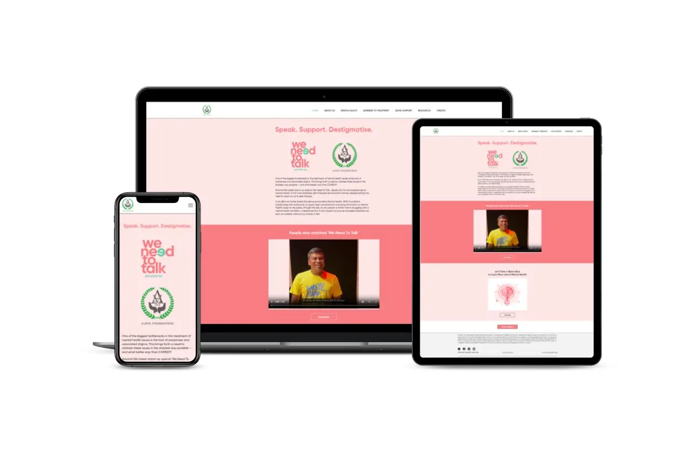

# Hi there 👋 I'm Srivignesh Kavle S ! </h1>

<h3 align="center">I am a skilled problem solver with a track record of successfully developing web and mobile applications ❤</h3>  

 An enthusiastic full-stack developer from India.I enjoy creating web applications and working with new technologies. I'm now studying how to enhance progressive web applications' performance for a better user experience. My goal is to work in a quality-driven, fast-paced company where I can put my skills to use and improve web and mobile app experiences. 

   
  

## Some of works
  
  - 🔭 I’m currently a student
- 🌱 I’m currently learning Full-stack development
- 💬 Ask me about any places in India
- 📫 How to reach me: ramnathkavle@gmail.com
- 😄 Pronouns: Him/His
- ⚡ Fun fact: Tea over Cofee
<!--
**Srivignesh95/Srivignesh95** is a ✨ _special_ ✨ repository because its `README.md` (this file) appears on your GitHub profile.

Here are some ideas to get you started:

-->
